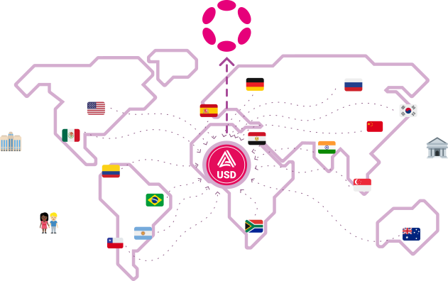

[VN]: https://virto.network
[AUSD]: https://acala.network/ausd

# Explainer

SwapCash is a decentralized protocol and *autonomous commercial community*(a form of DAO)
in the [Virto Network][VN], it allows members to trade local fiat currency with cryptocurrency
in a simple, secure, non-custodial, peer-to-peer way.

## Members 

**Cashiers** are the main role of the protocol, they enable local trades providing the various payment methods
that regular users can select from when cashing in or out.
Depending on their expected trading volume Cashiers use the protocol&#x27;s token **VSC** to pay for the membership
that better suits their needs whether they are single traders to big institutions.

- **Starter**
  Few trades a week
- **Standard**
  Regular trader
- **Pro**
  Large OTC trader

**Swappers** are regular users who wish to easily convert to/from a local currency to/from the stable coin of the network(aUSD)
that in turn can be converted to any supported cryptocurrency in the Polkadot
 ecosystem with the use of decentralized exchanges.  
The simplest way to perform swaps is with the swap.cash decentralized application or the Swap API, users get automatically
paired with a cashier based on their preferences and initiate an automated peer-to-peer exchange with support for end-to-end
encrypted chat, escrow and dispute resolution system provided by the Virto Network.

## Fiat-aUSD Liquidity Network

Instead of creating ramps from every local currency to every other crypto currency, SwapCash focuses its efforts in
providing the best liquidity for the decentralized stable crytocurrency of choice, the [Acala USD][AUSD], that
acts as the medium of exchange from which users can transparently jump to any other asset of the multi-chain
ecosystem. This simplified architecture allows us to better optimize and scale the swap insfrastructure.

The tighter integration with aUSD in turn brings more utility to the stablecoin, for example,
we can enable Cashiers to pool 
liquidity from different assets that don&#x27;t need to be sold but instead
can be used as collateral to **mint aUSD** and gain extra rewards in VSC.

## Tokenomics

The *VirtoSwapCash*(**VSC**) token, minted on Polkadot&#x27;s common good parachain 
Statemint([`#868367`](https://statemint.statescan.io/asset/868367)) with a fixed max supply of `31,415,926.535897932 VSC`,
it serves as the utility token of the protocol used by Cashiers to pay for memberships and by Swappers to pay tradinng fees.

Most of the supply VSC will be distributed to the community as part of our **10 year** *transparent marketing plan* 
distributed on weekly basis or burned when not spent.  
The team allocation ensures the long term sustainability of the protocol, SwapCash doesn&#x27;t pay an allowance to the core team, 
instad in buys VSC from them at a discount and burns the collected tokens.  
The Virto Network allocation is a requirement to ensure the sustainability of the meta-protocol.  
Lastly a small token allocation is left for sale to bootst
rap the project.

- Community *70%*
  - Swapper incentives
  - Cashier incentives
  - Other
- Team *20%*
- Virto Network *5%*
- Bootstrap *5%*

